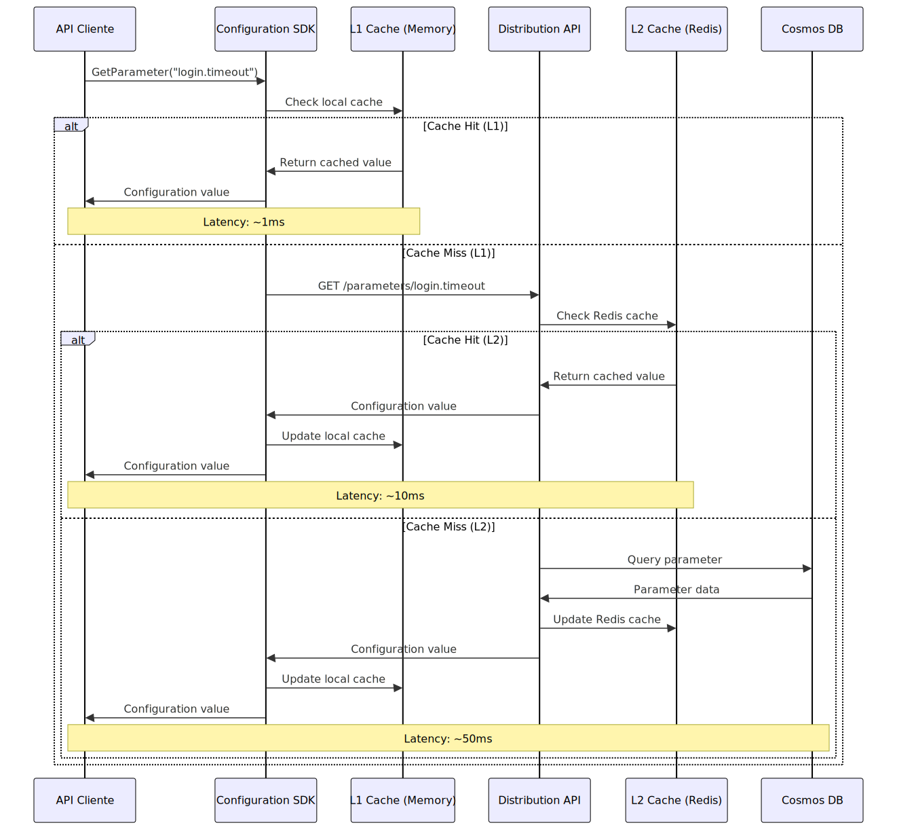
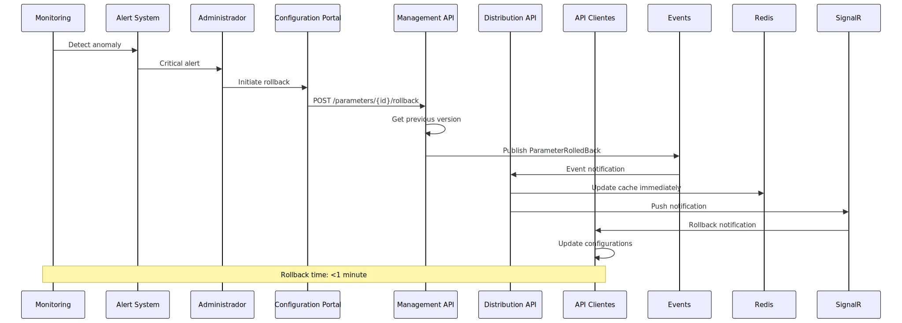

# DAS - Parametrizador de Configurações Dinâmicas

**Versão:** 1.0  
**Data:** 31 de julho de 2025  
**Arquitetos:** João Santos, Carlos Oliveira, Ana Costa  
**Revisores:** Maria Silva (PO), Pedro Lima (Cloud)  

---

## 1. Introdução e Objetivos

### 1.1 Requisitos

O Sistema de Parametrização de Configurações Dinâmicas (SPCD) tem como objetivo fornecer uma plataforma robusta, segura e escalável para gerenciamento centralizado de parâmetros de configuração para os canais digitais da CAIXA, permitindo atualizações em tempo real sem necessidade de deployments.

#### Requisitos Funcionais Principais

1. **RF001 - Gestão de Parâmetros**
   - Criar, atualizar, consultar e excluir parâmetros de configuração
   - Versionamento automático com histórico completo
   - Classificação por criticidade (crítico, importante, normal)
   - Suporte a diferentes tipos de dados (string, number, boolean, object, array)

2. **RF002 - Distribuição em Tempo Real**
   - Propagação de mudanças para APIs clientes em tempo real
   - Suporte a push notifications para parâmetros críticos
   - Cache distribuído para otimização de performance
   - Fallback para modo offline

3. **RF003 - Workflow de Aprovação**
   - Aprovação em 2 níveis para parâmetros críticos
   - Agendamento de mudanças para janelas de manutenção
   - Notificações automáticas para aprovadores
   - Rollback automático em caso de falha

4. **RF004 - Auditoria e Compliance**
   - Log imutável de todas as mudanças
   - Rastreabilidade completa (quem, quando, o quê, porquê)
   - Relatórios de compliance (LGPD, SOX, BCB)
   - Retenção de dados por 7 anos

5. **RF005 - Interface Administrativa**
   - Portal web para gestão de parâmetros
   - Dashboard com métricas e analytics
   - Gestão de usuários e permissões (RBAC)
   - Visualização de histórico e tendências

#### Requisitos Não-Funcionais

1. **RNF001 - Performance**
   - SLA de propagação: 2 min (críticos), 10 min (importantes), 30 min (normais)
   - Throughput: 10,000 requests/segundo, 2.5M requests/dia, 75M requests/mês
   - Latência: < 100ms para consultas em cache
   - Concurrent users: 500 usuários administrativos

2. **RNF002 - Disponibilidade**
   - Uptime: 99.95% (SLA bancário)
   - RPO: 15 minutos
   - RTO: 30 minutos
   - Disaster recovery multi-região

3. **RNF003 - Escalabilidade**
   - Auto-scaling baseado em demanda
   - Suporte para 1000+ APIs clientes
   - Capacidade para 10,000+ parâmetros
   - Elasticidade de recursos Azure

4. **RNF004 - Segurança**
   - Autenticação via SISET Login Intranet (Keycloak CAIXA)
   - APIs clientes propagam token SISET do LoginX integrado ao COBOL SIPER
   - Autorização granular (RBAC)
   - Criptografia em trânsito e repouso
   - Network isolation (Private Endpoints)

### 1.2 Objetivos de Qualidade

| Qualidade | Prioridade | Cenário | Métrica |
|-----------|------------|---------|---------|
| **Performance** | Alta | Propagação de parâmetro crítico em horário de pico | < 2 minutos em 99% dos casos |
| **Disponibilidade** | Alta | Falha de região Azure durante horário comercial | Sistema continua operando com RTO < 30 min |
| **Segurança** | Crítica | Tentativa de acesso não autorizado a parâmetros críticos | 100% bloqueado com log de auditoria |
| **Usabilidade** | Média | Administrador cria novo parâmetro | < 3 cliques e validação automática |
| **Manutenibilidade** | Média | Deploy de nova versão da API | Zero-downtime deployment |

### 1.3 Stakeholders

| Stakeholder | Responsabilidade | Expectativa |
|-------------|------------------|-------------|
| **Squads de Desenvolvimento** | Consumidores dos parâmetros | APIs estáveis, SDK fácil de usar, documentação clara |
| **Squad de Arquitetura** | Manutenção e evolução | Código limpo, testes automatizados, observabilidade |
| **Operações** | Monitoramento 24x7 | Runbooks, alertas proativos, dashboards claros |
| **Segurança** | Compliance e auditoria | Logs imutáveis, controles de acesso, criptografia |
| **Auditoria Interna** | Verificação de controles | Trilhas de auditoria, relatórios automatizados |
| **Reguladores (BCB)** | Supervisão bancária | Compliance com resoluções, relatórios periódicos |

---

## 2. Restrições

### 2.1 Restrições Técnicas

#### RT001 - Tecnológicas
- **Plataforma**: Microsoft Azure (política corporativa)
- **Linguagem Backend**: .NET 8+ (padronização CAIXA)
- **Frontend**: Angular 16+ (padronização CAIXA)
- **Container**: Docker com AKS (política de containerização)
- **Banco de Dados**: Cosmos DB (NoSQL escolhido para o domínio)

#### RT002 - Integração
- **Autenticação Interna**: SISET Login Intranet (Keycloak CAIXA) obrigatório
- **Autenticação APIs Clientes**: Token SISET do LoginX integrado ao COBOL SIPER
- **API BFF**: Camada de proteção para APIs externas na internet
- **Monitoramento**: Application Insights mandatório
- **Logging**: Padrão CAIXA com Event Hub
- **Networking**: Private Endpoints obrigatórios

#### RT003 - Performance
- **Cache**: Redis obrigatório para performance
- **CDN**: Azure Front Door para distribuição global
- **Load Balancer**: Azure Load Balancer padrão

### 2.2 Restrições Organizacionais

#### RO001 - Compliance
- **LGPD**: Classificação e proteção de dados pessoais
- **BCB Resolução 4658**: Política de Segurança Cibernética
- **SOX**: Controles internos para mudanças
- **ISO 27001**: Gestão de segurança da informação

#### RO002 - Operacionais
- **Horário de Deployment**: A qualquer hora via pipeline CI/CD madura com blue/green
- **Change Management**: Processo ITIL obrigatório
- **Backup**: Retenção de 7 anos para auditoria
- **Disaster Recovery**: RTO < 30 min, RPO < 15 min

#### RO003 - Orçamentárias
- **Budget Anual**: R$ 400.000 para infraestrutura
- **ROI**: Payback em 18 meses
- **Cost Control**: Alertas para 80% do orçamento

### 2.3 Convenções

#### CV001 - Desenvolvimento
- **Coding Standards**: Microsoft C# Guidelines
- **API Design**: RESTful com OpenAPI 3.0
- **Versionamento**: Semantic Versioning (semver)
- **Testes**: Coverage mínimo de 80%

#### CV002 - Documentação
- **Arquitetura**: Templates Arc42
- **APIs**: OpenAPI/Swagger
- **Runbooks**: Markdown no Azure DevOps
- **ADRs**: Architecture Decision Records

#### CV003 - Nomenclatura
- **Recursos Azure**: `{tipo}-{sistema}-{ambiente}-{região}`
- **APIs**: `/sinbm-{servico}/v{versao}/{recurso}`
- **Parâmetros**: `{dominio}.{categoria}.{nome}`
- **Containers**: `sinbm/{servico}:{versao}`

---

## 3. Contexto e Escopo

### 3.1 Contexto de Negócio


### 3.2 Contexto Técnico



### 3.3 Interfaces Externas

#### IF001 - SISET Login Intranet (Keycloak CAIXA)
- **Tipo**: Authentication & Authorization (Serviços Internos)
- **Protocolo**: OAuth 2.0 / OpenID Connect
- **Uso**: Autenticação de usuários administrativos na intranet CAIXA

#### IF002 - SISET LoginX + COBOL SIPER
- **Tipo**: Authentication & Authorization (APIs Clientes)
- **Protocolo**: Token SISET propagado via APIs
- **Uso**: Autenticação de APIs clientes (login, antifraude, etc.)

#### IF003 - API BFF (Camada de Proteção)
- **Tipo**: Security Gateway
- **Protocolo**: HTTPS / REST
- **Uso**: Proteção para acesso de Apps e aplicações externas via internet

#### IF004 - Application Insights
- **Tipo**: Observability
- **Protocolo**: HTTPS / Telemetry SDK
- **Uso**: Logs, métricas, traces e monitoramento

#### IF005 - Event Hub (Auditoria CAIXA)
- **Tipo**: Audit Trail
- **Protocolo**: AMQP 1.0
- **Uso**: Envio de eventos de auditoria para o Data Lake corporativo

#### IF006 - APIs Clientes
- **Tipo**: Consumer Integration
- **Protocolo**: HTTPS / REST
- **Uso**: Distribuição de parâmetros via SDK ou API REST

---

## 4. Estratégia da Solução

### 4.1 Decisões Tecnológicas Fundamentais

#### Arquitetura Event-Driven para Propagação
**Decisão**: Implementar arquitetura orientada a eventos para propagação de parâmetros críticos.

**Justificativa**: 
- SLA de 2 minutos para parâmetros críticos não pode ser atendido com polling
- Event Grid + SignalR permite push notifications em tempo real
- Mantém backward compatibility com polling como fallback

**Tecnologias**: Azure Event Grid, SignalR, Redis Pub/Sub

#### Cosmos DB como Data Store Principal
**Decisão**: Migrar de Azure Blob Storage para Cosmos DB como repositório principal.

**Justificativa**:
- Versionamento nativo e queries complexas
- Suporte a transações ACID para workflow de aprovação
- Geo-replicação para disaster recovery
- Performance superior para reads/writes frequentes

**Configuração**: SQL API, multi-region write, consistent prefix

#### Microservices com Domain Separation
**Decisão**: Separar responsabilidades em microservices específicos.

**Justificativa**:
- Configuration Management: CRUD e workflow
- Configuration Distribution: Otimizado para leitura e cache
- Separation of concerns e escalabilidade independente

### 4.2 Padrões Arquiteturais

#### Command Query Responsibility Segregation (CQRS)
- **Write Side**: Configuration Management API
- **Read Side**: Configuration Distribution API
- **Synchronization**: Event Grid + Azure Functions

#### Event Sourcing para Auditoria
- **Events**: ParameterCreated, ParameterUpdated, ParameterApproved
- **Store**: Cosmos DB Change Feed → Event Hub → Data Lake
- **Replay**: Capacidade de reconstruir estado a partir de eventos

#### Circuit Breaker Pattern
- **SDK Implementation**: Hystrix-style circuit breaker
- **Fallback**: Cache local → Storage Account → Default values
- **Monitoring**: Health checks e métricas de falha

### 4.3 Estratégia de Cache

#### Multi-Layer Caching
1. **L1 - Application Cache**: In-memory cache no SDK (TTL: 5 min)
2. **L2 - Distributed Cache**: Redis Enterprise (TTL: 30 min)  
3. **L3 - CDN Cache**: Azure Front Door (TTL: 60 min para estáticos)

#### Cache Invalidation
- **Event-driven**: Event Grid → Cache invalidation
- **TTL-based**: Automatic expiration
- **Manual**: Admin portal com cache clear

---

## 5. Visão de Blocos de Construção

### 5.1 Whitebox - Sistema Geral



### 5.2 Configuration Management Service

#### Responsabilidades
- CRUD operations para parâmetros
- Versionamento e histórico
- Workflow de aprovação
- Validação de schema

#### Interfaces
- **REST API**: Operações administrativas
- **Event Publisher**: Notificações de mudança
- **Database**: Cosmos DB para persistência

#### Componentes Internos
- **Parameter Controller**: REST endpoints
- **Approval Workflow**: Logic Apps integration
- **Validation Engine**: JSON Schema validation
- **Event Publisher**: Event Grid integration

### 5.3 Configuration Distribution Service

#### Responsabilidades
- Distribuição otimizada de parâmetros
- Cache management
- Push notifications
- Health checks

#### Interfaces
- **REST API**: Consulta de parâmetros
- **SignalR Hub**: Push notifications
- **Cache**: Redis para performance

#### Componentes Internos
- **Distribution Controller**: Read-only endpoints
- **Cache Manager**: Redis operations
- **Notification Hub**: SignalR real-time
- **Health Monitor**: Service health

### 5.4 Configuration SDK

#### Responsabilidades
- Client library para APIs consumidoras
- Cache local inteligente
- Circuit breaker implementation
- Telemetry integration

#### Features
- **Auto-refresh**: Background polling/push
- **Fallback Strategy**: Multiple fallback levels
- **Type Safety**: Strongly typed configurations
- **Metrics**: Performance telemetry

### 5.5 API BFF (Camada de Proteção)

#### Responsabilidades
- Camada de proteção para acesso via internet
- Rate limiting e throttling
- Validação de tokens SISET do LoginX
- Transformação de dados para clientes externos

#### Interfaces
- **REST API**: Endpoints públicos para Apps e aplicações externas
- **Security Gateway**: Validação de autenticação/autorização
- **Cache**: Redis para performance

#### Componentes Internos
- **Gateway Controller**: Endpoints públicos seguros
- **Security Validator**: Validação de tokens SISET/LoginX
- **Rate Limiter**: Controle de throughput
- **Request Transformer**: Adaptação de requests/responses

---

## 6. Visão de Runtime

### 6.1 Cenário: Criação de Parâmetro Crítico


### 6.2 Cenário: Consulta de Parâmetro em Cache



### 6.3 Cenário: Rollback de Parâmetro



### 6.4 Cenário: Disaster Recovery


---

## 7. Visão de Implantação

### 7.1 Infraestrutura Target



### 7.2 Mapping Software → Hardware

| Componente Software | Recurso Azure | Configuração | Observações |
|---------------------|---------------|--------------|-------------|
| **Configuration Management API** | AKS Pod | 2 vCPU, 4GB RAM, 3 replicas | Auto-scaling 3-10 pods |
| **Configuration Distribution API** | AKS Pod | 2 vCPU, 4GB RAM, 5 replicas | Auto-scaling 5-20 pods |
| **Configuration Portal** | AKS Pod | 1 vCPU, 2GB RAM, 2 replicas | Static content + API calls |
| **API BFF (Camada Proteção)** | AKS Pod | 2 vCPU, 4GB RAM, 3 replicas | Auto-scaling para internet |
| **Workflow Engine** | Azure Functions Premium | 2 vCPU, 7GB RAM | Event-driven scaling |
| **Cosmos DB** | Cosmos DB SQL API | 15,000 RU/s, multi-region | Auto-scaling 10k-50k RU/s |
| **Redis Cache** | Azure Cache for Redis Enterprise | 6GB, 2 replicas | High availability |
| **Event Grid** | Event Grid | Standard tier | Pay-per-event |
| **Front Door** | Azure Front Door Standard | Global | WAF enabled |

### 7.3 Deployment Strategy

#### Blue-Green Deployment com Pipeline CI/CD Madura
- **Blue Environment**: Produção atual
- **Green Environment**: Nova versão
- **Switch**: Gradual via DNS/Load Balancer cutover
- **Rollback**: Immediate switch back to Blue
- **Horário**: A qualquer hora (24x7) via pipeline automatizado

#### Rolling Update for AKS
- **Max Unavailable**: 25%
- **Max Surge**: 25%
- **Health Checks**: ReadinessProbe + LivenessProbe
- **Rollback**: Automatic on health check failure

#### Database Migration Strategy
- **Phase 1**: Dual-write (Storage Account + Cosmos DB)
- **Phase 2**: Validation and consistency checks
- **Phase 3**: Read cutover to Cosmos DB
- **Phase 4**: Write cutover and Storage Account deprecation

---

## 8. Conceitos Transversais

### 8.1 Modelo de Domínio


### 8.2 Padrões de Segurança

#### Authentication & Authorization
- **Identity Provider Interno**: SISET Login Intranet (Keycloak CAIXA)
- **Identity Provider APIs**: SISET LoginX + COBOL SIPER
- **Token**: JWT with custom claims via SISET
- **Authorization**: RBAC with fine-grained permissions
- **API Security**: OAuth 2.0 + OpenID Connect
- **Internet Protection**: API BFF como camada de proteção

#### Data Protection
- **Encryption at Rest**: AES-256 (Azure managed keys)
- **Encryption in Transit**: TLS 1.3
- **Key Management**: Azure Key Vault with HSM
- **Sensitive Data**: Additional encryption for PII

#### Network Security
- **Network Isolation**: Private Endpoints
- **WAF**: Azure Front Door with OWASP rules
- **DDoS Protection**: Azure DDoS Protection Standard
- **VNet**: Isolated virtual networks
- **Intranet Segregation**: Portal administrativo apenas na intranet CAIXA

### 8.3 Padrões de Observabilidade

#### Logging Strategy
```json
{
  "timestamp": "2025-08-01T14:30:00Z",
  "level": "INFO",
  "service": "configuration-management",
  "operation": "parameter-update",
  "userId": "joao.santos@caixa.gov.br",
  "parameterId": "login.timeout.api",
  "correlationId": "abc-123-def-456",
  "duration": 250,
  "status": "success",
  "compliance": {
    "lgpd": true,
    "sox": true
  }
}
```

#### Metrics Strategy
- **Business Metrics**: Parameter changes/hour, approval time
- **Technical Metrics**: API latency, cache hit ratio, error rate
- **Throughput Metrics**: Requests/segundo, requests/dia, requests/mês
- **Infrastructure Metrics**: CPU, memory, disk, network
- **Custom Metrics**: SDK adoption, fallback usage

#### Distributed Tracing
- **Correlation ID**: Request tracing across services
- **Span Tags**: Service, operation, user, parameter
- **Sampling**: 1% for normal, 100% for errors
- **Retention**: 30 days for traces

### 8.4 Padrões de Tratamento de Erro

#### Error Categories
1. **Business Errors**: Invalid parameter values, approval required
2. **Technical Errors**: Database timeouts, network failures
3. **Security Errors**: Unauthorized access, invalid tokens
4. **Infrastructure Errors**: Service unavailable, rate limits

#### Error Response Format
```json
{
  "error": {
    "code": "PARAMETER_VALIDATION_FAILED",
    "message": "Parameter value does not match schema",
    "details": {
      "parameterId": "login.timeout.api",
      "field": "timeout",
      "expected": "number between 1000 and 60000",
      "actual": "30"
    },
    "timestamp": "2025-08-01T14:30:00Z",
    "correlationId": "abc-123-def-456"
  }
}
```

#### Retry Strategy
- **Exponential Backoff**: 1s, 2s, 4s, 8s, 16s
- **Max Retries**: 5 for idempotent operations
- **Circuit Breaker**: Open after 5 consecutive failures
- **Jitter**: Random delay to prevent thundering herd

---

## 9. Decisões Arquiteturais

### ADR-001: Cosmos DB como Primary Storage

**Status**: Accepted  
**Data**: 01/08/2025  
**Arquitetos**: João Santos, Carlos Oliveira  

#### Contexto
O sistema atual utiliza Azure Blob Storage para armazenar configurações em formato JSON. Esta abordagem apresenta limitações para versionamento, queries complexas e transações ACID necessárias para workflow de aprovação.

#### Decisão
Migrar de Azure Blob Storage para Cosmos DB (SQL API) como repositório principal de parâmetros.

#### Consequências

**Positivas**:
- Versionamento nativo e queries SQL complexas
- Suporte a transações ACID para workflows
- Geo-replicação automática para DR
- Performance superior para reads/writes frequentes
- Indexação automática para queries eficientes

**Negativas**:
- Custo superior (~3x comparado ao Blob Storage)
- Curva de aprendizado para queries SQL no Cosmos DB
- Migração complexa de dados existentes
- Necessidade de redesign do modelo de dados

**Mitigações**:
- Implementar migração gradual com dual-write
- Treinamento da equipe em Cosmos DB
- Monitoramento de custos com alertas
- Fallback para Blob Storage durante migração

### ADR-002: Event-Driven Architecture para Propagação

**Status**: Accepted  
**Data**: 01/08/2025  
**Arquitetos**: João Santos, Pedro Lima  

#### Contexto
SLA de 2 minutos para propagação de parâmetros críticos não pode ser atendido consistentemente com arquitetura baseada em polling. Necessidade de push notifications em tempo real.

#### Decisão
Implementar arquitetura orientada a eventos usando Azure Event Grid e SignalR para propagação de mudanças críticas.

#### Consequências

**Positivas**:
- Propagação em tempo real para parâmetros críticos
- Redução de latência de ~5 minutos para ~30 segundos
- Menor carga de polling nos serviços
- Escalabilidade automática baseada em eventos

**Negativas**:
- Maior complexidade arquitetural
- Dependência adicional (Event Grid, SignalR)
- Necessidade de tratamento de eventos duplicados
- Debugging mais complexo

**Mitigações**:
- Manter polling como fallback
- Implementar idempotência em todos os handlers
- Monitoring extensivo de eventos
- Circuit breaker no SDK para falhas

### ADR-003: Multi-Level Approval Workflow

**Status**: Accepted  
**Data**: 01/08/2025  
**Arquitetos**: Carlos Oliveira, Maria Silva  

#### Contexto
Requisitos SOX e BCB 4658 exigem segregação de funções e controle de mudanças. Parâmetros críticos necessitam aprovação de múltiplos níveis.

#### Decisão
Implementar workflow de aprovação em 2 níveis usando Azure Logic Apps para orquestração.

#### Consequências

**Positivas**:
- Compliance com SOX e regulamentações bancárias
- Segregação clara de responsabilidades
- Trilha de auditoria completa
- Redução de riscos operacionais

**Negativas**:
- Processo mais lento para mudanças críticas
- Complexidade adicional na interface
- Dependência de aprovadores disponíveis
- Possibilidade de gargalos

**Mitigações**:
- Escalation automático após timeout
- Múltiplos aprovadores por nível
- Notificações proativas
- Emergency override para situações críticas

### ADR-004: Backward Compatibility Obrigatória

**Status**: Accepted  
**Data**: 01/08/2025  
**Arquitetos**: João Santos, Ana Costa  

#### Contexto
43 APIs clientes em produção utilizando SDK atual. Migração forçada causaria downtime significativo e resistência dos squads.

#### Decisão
SDK v2.0 deve manter 100% de backward compatibility com APIs existentes durante período de migração.

#### Consequências

**Positivas**:
- Zero-downtime migration
- Adoção gradual e voluntária
- Redução de riscos de quebra
- Confiança dos squads consumidores

**Negativas**:
- Código legado temporário no SDK
- Manutenção de duas versões de API
- Cleanup complexo após migração
- Performance sub-ótima durante transição

**Mitigações**:
- Deadline claro para deprecação de APIs v1
- Incentivos para migração (features exclusivas v2)
- Monitoramento de uso de APIs legadas
- Documentação clara de migration path

---

## 10. Requisitos de Qualidade

### 10.1 Árvore de Qualidade



### 10.2 Cenários de Qualidade

#### QS-001: Performance - Propagação de Parâmetro Crítico
**Cenário**: Durante horário de pico (14h), administrador altera parâmetro crítico de timeout de login  
**Estímulo**: Mudança aprovada e ativada  
**Ambiente**: Sistema em produção com 100% de carga  
**Resposta**: Parâmetro propagado para todas as 43 APIs clientes  
**Métrica**: 99% das APIs recebem atualização em < 2 minutos  

**Táticas Implementadas**:
- Event-driven propagation com Azure Event Grid
- Push notifications via SignalR
- Cache pre-warming para parâmetros críticos
- CDN para distribuição global

#### QS-002: Availability - Falha de Região
**Cenário**: Região Brasil Sul fica indisponível durante horário comercial  
**Estímulo**: Falha de conectividade regional  
**Ambiente**: Sistema em produção, pico de uso  
**Resposta**: Failover automático para Brasil Sudeste  
**Métrica**: Sistema continua operando com RTO < 30 minutos  

**Táticas Implementadas**:
- Multi-region deployment com Cosmos DB
- Azure Traffic Manager para failover automático
- Health checks distribuídos
- Geo-replication para Redis e Storage

#### QS-003: Security - Tentativa de Acesso Não Autorizado
**Cenário**: Usuário externo tenta acessar parâmetros confidenciais  
**Estímulo**: Request HTTP sem token válido  
**Ambiente**: Sistema em produção  
**Resposta**: Acesso negado e evento logado  
**Métrica**: 100% das tentativas bloqueadas, log em < 1 segundo  

**Táticas Implementadas**:
- Azure AD integration com JWT validation
- Private Endpoints para isolamento de rede
- WAF com regras OWASP
- Audit logging imutável

#### QS-004: Usability - Criação de Novo Parâmetro
**Cenário**: Administrador de squad cria novo parâmetro de feature flag  
**Estímulo**: Necessidade de configuração para nova funcionalidade  
**Ambiente**: Portal administrativo  
**Resposta**: Parâmetro criado e disponível para consumo  
**Métrica**: < 3 cliques, validação automática, disponível em < 5 minutos  

**Táticas Implementadas**:
- Interface intuitiva com wizard
- Validação de schema em tempo real
- Templates pré-definidos
- Preview antes da submissão

#### QS-005: Maintainability - Deploy de Nova Versão
**Cenário**: Squad de arquitetura faz deploy de nova versão da API  
**Estímulo**: Nova funcionalidade ou correção de bug  
**Ambiente**: Pipeline CI/CD  
**Resposta**: Deploy realizado sem downtime  
**Métrica**: Zero-downtime deployment, rollback em < 2 minutos se necessário  

**Táticas Implementadas**:
- Blue-green deployment strategy
- Health checks automatizados
- Rollback automático em falhas
- Canary releases para validação

### 10.3 Métricas de Qualidade

| Métrica | Target | Measurement Method | Frequency |
|---------|--------|-------------------|-----------|
| **API Latency** | p95 < 100ms | Application Insights | Real-time |
| **Cache Hit Ratio** | > 95% | Redis metrics | Real-time |
| **Propagation Time** | < 2min (critical) | Custom telemetry | Per change |
| **System Availability** | 99.95% | Azure Monitor | Monthly |
| **Error Rate** | < 0.1% | Application Insights | Real-time |
| **Approval Time** | < 4 hours | Workflow metrics | Per approval |
| **SDK Adoption** | > 90% in 6 months | Custom tracking | Monthly |
| **User Satisfaction** | > 4.5/5 | Survey | Quarterly |

---

## 11. Riscos e Débito Técnico

### 11.1 Riscos Identificados

#### R-001: Alto Risco - Latência de Propagação
**Descrição**: Sistema não consegue atender SLA de 2 minutos para parâmetros críticos  
**Probabilidade**: Média (30%)  
**Impacto**: Alto - Violação de SLA bancário  
**Mitigação**:
- Implementar push notifications via SignalR
- CDN para parâmetros globais com cache inteligente
- Circuit breaker no SDK com fallback local
- Monitoring proativo com alertas

**Status**: Em mitigação  
**Owner**: João Santos  
**Timeline**: Sprint 1-2  

#### R-002: Médio Risco - Complexidade Operacional
**Descrição**: Arquitetura event-driven aumenta complexidade de troubleshooting  
**Probabilidade**: Alta (60%)  
**Impacto**: Médio - Dificuldade de manutenção  
**Mitigação**:
- Distributed tracing com correlation IDs
- Runbooks detalhados para cenários comuns
- Training intensivo para equipe de operações
- Dashboard de observabilidade específico

**Status**: Pendente  
**Owner**: Roberto Alves  
**Timeline**: Sprint 3-4  

#### R-003: Alto Risco - Resistência à Migração
**Descrição**: Squads clientes resistem à adoção do novo SDK  
**Probabilidade**: Média (40%)  
**Impacto**: Alto - ROI não atingido  
**Mitigação**:
- Backward compatibility 100% durante transição
- Quick wins demonstráveis (melhor performance)
- Suporte dedicado durante migração
- Incentivos técnicos (features exclusivas)

**Status**: Em mitigação  
**Owner**: Maria Silva  
**Timeline**: Contínuo  

#### R-004: Baixo Risco - Custos Além do Orçamento
**Descrição**: Infraestrutura Cosmos DB pode exceder budget aprovado  
**Probabilidade**: Baixa (20%)  
**Impacto**: Médio - Necessidade de re-aprovação  
**Mitigação**:
- Monitoring de custos com alertas em 80% do budget
- Auto-scaling configurado corretamente
- Reserved instances para redução de custos
- Revisão mensal de usage e otimização

**Status**: Monitorado  
**Owner**: Pedro Lima  
**Timeline**: Contínuo  

### 11.2 Débito Técnico Atual

#### DT-001: Storage Account Legacy
**Descrição**: Dependência do Azure Blob Storage para fallback  
**Impacto**: Manutenção de duas fontes de verdade durante migração  
**Estratégia de Pagamento**:
- Fase 1: Dual-write para garantir consistência
- Fase 2: Validação automatizada entre storages
- Fase 3: Cutover gradual para Cosmos DB
- Fase 4: Deprecação e remoção do Storage Account

**Timeline**: 6 meses  
**Effort**: 40 story points  

#### DT-002: Polling Implementation
**Descrição**: Código de polling mantido como fallback para push notifications  
**Impacto**: Complexidade adicional no SDK e maior consumo de recursos  
**Estratégia de Pagamento**:
- Monitoring de uso de polling vs push
- Gradual increase do intervalo de polling
- Eventual removal após 100% de adoção de push
- Feature flag para controlar comportamento

**Timeline**: 8 meses  
**Effort**: 25 story points  

#### DT-003: Manual Testing
**Descrição**: Testes de integração e performance são majoritariamente manuais  
**Impacto**: Deploy mais lento e risco de regressões  
**Estratégia de Pagamento**:
- Automated integration tests no pipeline
- Performance testing automatizado
- Contract testing para APIs
- Chaos engineering para resilience

**Timeline**: 4 meses  
**Effort**: 60 story points  

### 11.3 Plano de Mitigação de Riscos

#### Monitoring e Alertas Proativos
```yaml
Alerts:
  - name: "Parameter Propagation SLA"
    condition: "avg_propagation_time > 2_minutes"
    threshold: "critical parameters"
    action: "page on-call engineer"
    
  - name: "API Error Rate"
    condition: "error_rate > 1%"
    threshold: "5 minutes sustained"
    action: "notify squad + auto-rollback"
    
  - name: "Cache Hit Ratio"
    condition: "hit_ratio < 90%"
    threshold: "15 minutes sustained"
    action: "investigate cache issues"
    
  - name: "Cost Monitoring"
    condition: "monthly_cost > 80% budget"
    threshold: "daily check"
    action: "notify financial controller"
```

#### Disaster Recovery Procedures
1. **Automated Failover**: Health checks → Traffic Manager → Secondary region
2. **Manual Failover**: Runbook for planned maintenance
3. **Data Recovery**: Point-in-time restore for Cosmos DB
4. **Communication Plan**: Stakeholder notification via Teams

#### Performance Optimization Plan
- **Phase 1**: Baseline current performance
- **Phase 2**: Implement caching strategies
- **Phase 3**: Optimize database queries
- **Phase 4**: CDN and edge optimization

---

## 12. Glossário

### Termos de Domínio

**Parâmetro de Configuração**: Valor nomeado que controla comportamento de aplicações sem necessidade de deploy

**Criticidade**: Classificação de urgência de propagação (Crítico: 2min, Importante: 10min, Normal: 30min)

**Feature Flag**: Tipo específico de parâmetro que controla habilitação/desabilitação de funcionalidades

**Workflow de Aprovação**: Processo estruturado de validação e aprovação de mudanças em parâmetros

**Propagação**: Processo de distribuição de mudanças de parâmetros para todas as APIs clientes

**Rollback**: Reversão de parâmetro para versão anterior em caso de problema

### Termos Técnicos

**SDK (Software Development Kit)**: Biblioteca cliente .NET para consumo de parâmetros dinâmicos

**Push Notification**: Notificação em tempo real de mudanças enviada via SignalR

**Circuit Breaker**: Padrão de design para prevenção de falhas em cascata

**Cache L1/L2**: Estratégia de cache em múltiplas camadas (local/distribuído)

**Event-Driven**: Arquitetura baseada em eventos assíncronos

**Blue-Green Deployment**: Estratégia de deploy com dois ambientes idênticos

### Termos de Compliance

**LGPD**: Lei Geral de Proteção de Dados Pessoais (Lei 13.709/2018)

**SOX**: Sarbanes-Oxley Act - Controles internos para empresas públicas

**BCB 4658**: Resolução do Banco Central sobre Política de Segurança Cibernética

**RBAC**: Role-Based Access Control - Controle de acesso baseado em papéis

**Audit Trail**: Trilha de auditoria imutável para compliance

### Métricas e SLAs

**RPO**: Recovery Point Objective - Perda máxima aceitável de dados

**RTO**: Recovery Time Objective - Tempo máximo para recuperação

**SLA**: Service Level Agreement - Acordo de nível de serviço

**Throughput**: Número de requests processados por unidade de tempo

**Latência**: Tempo de resposta para uma operação

### Acrônimos Azure e CAIXA

**AKS**: Azure Kubernetes Service

**SISET**: Sistema de Autenticação CAIXA (Keycloak)

**LoginX**: Sistema de Login CAIXA integrado ao COBOL SIPER

**SIPER**: Sistema COBOL de Autenticação CAIXA

**WAF**: Web Application Firewall

**CDN**: Content Delivery Network

**VNet**: Virtual Network

**NSG**: Network Security Group

**BFF**: Backend for Frontend (Camada de Proteção)

---

**Aprovação Final**  
**Data**: 31/07/2025  
**Arquiteto Chief**: João Santos  
**PO**: Maria Silva  
**Cloud Architect**: Pedro Lima  

**Próxima Revisão**: 31/10/2025  
**Status**: ✅ Aprovado para Implementação
