# C4 Model - Container Diagram - Sistema de Parametrização

**Sistema**: Parametrizador de Configurações Dinâmicas  
**Nível**: 2 - Container  
**Audiência**: Arquitetos de software, desenvolvedores sênior  

## Visão Geral

Este diagrama mostra a decomposição em containers do Sistema de Parametrização de Configurações Dinâmicas, incluindo aplicações web, APIs, bancos de dados e como eles interagem entre si.

## Container Diagram



## Detalhamento dos Containers

### Presentation Layer

#### Configuration Portal (Angular SPA)
- **Tecnologia**: Angular 16 + TypeScript + Material Design
- **Responsabilidades**:
  - Interface para gestão de parâmetros (CRUD)
  - Workflow de aprovação com visualização de status
  - Dashboard analytics com métricas de uso
  - Gestão de usuários e permissões (RBAC)
- **Integrações**: Management API, Azure AD
- **Deployment**: Azure Static Web Apps com CDN

#### Web App (Static Web Apps)
- **Tecnologia**: Azure Static Web Apps + Azure CDN
- **Responsabilidades**:
  - Hospedagem da SPA Angular
  - Distribuição global via CDN
  - Custom domain e SSL automático
  - Authentication integration com Azure AD

### Application Services

#### Configuration Management API
- **Tecnologia**: ASP.NET Core 8 + Minimal APIs
- **Responsabilidades**:
  - CRUD operations para parâmetros
  - Versionamento automático com change log
  - Workflow de aprovação multi-nível
  - Validação de schema JSON Schema
  - Event publishing para mudanças
- **Patterns**: CQRS, Repository, Mediator
- **Deployment**: Azure Container Apps ou AKS

#### Configuration Distribution API
- **Tecnologia**: ASP.NET Core 8 + SignalR
- **Responsabilidades**:
  - Consulta otimizada de parâmetros (read-only)
  - Cache management com Redis
  - Push notifications via SignalR
  - Health checks e circuit breaker
  - ETag support para conditional requests
- **Patterns**: Cache-Aside, Circuit Breaker
- **Deployment**: Azure Container Apps ou AKS

#### Workflow Engine
- **Tecnologia**: Azure Functions v4 + Durable Functions
- **Responsabilidades**:
  - Orquestração de aprovações multi-nível
  - Agendamento de mudanças
  - Notificações automáticas (Teams/Email)
  - Escalation de timeouts
  - State management para workflows
- **Triggers**: Event Grid, Timer, HTTP
- **Deployment**: Function App Premium

#### Audit Service
- **Tecnologia**: Azure Functions v4 + Event Hubs
- **Responsabilidades**:
  - Processamento de eventos de auditoria
  - Geração de relatórios compliance
  - Alertas de segurança
  - Data transformation para analytics
  - Integration com Data Lake
- **Triggers**: Event Grid, Event Hub
- **Deployment**: Function App Consumption

### Data Layer

#### Configuration Database (Cosmos DB)
- **Tecnologia**: Azure Cosmos DB SQL API
- **Responsabilidades**:
  - Repositório principal de parâmetros
  - Versionamento e histórico
  - Change requests e aprovações
  - Audit logs imutáveis
- **Partitioning**: Por domain para distribuição
- **Consistency**: Session level
- **Backup**: Continuous backup com point-in-time restore

#### Cache Layer (Redis)
- **Tecnologia**: Azure Cache for Redis Enterprise
- **Responsabilidades**:
  - Cache distribuído para performance
  - Session storage para SignalR
  - Pub/Sub para cache invalidation
  - Connection pooling e clustering
- **Configuration**: 6GB standard com replication
- **Persistence**: RDB snapshots para backup

#### Backup Storage (Blob Storage)
- **Tecnologia**: Azure Blob Storage Hot Tier
- **Responsabilidades**:
  - Backup de configurações para DR
  - Fallback durante migração
  - Archive de versões antigas
  - Static content para portal
- **Redundancy**: GRS (Geo-Redundant Storage)
- **Lifecycle**: Automatic tiering para Cool/Archive

### Integration Layer

#### Event Grid
- **Tecnologia**: Azure Event Grid Custom Topics
- **Responsabilidades**:
  - Event routing para mudanças de parâmetros
  - Decoupling entre services
  - Dead letter handling
  - Event replay capability
- **Topics**: parameter-changes, critical-parameter-changes
- **Schema**: CloudEvents 1.0

#### SignalR Service
- **Tecnologia**: Azure SignalR Service Standard
- **Responsabilidades**:
  - Push notifications em tempo real
  - Connection management e scaling
  - Group targeting por domain
  - Automatic reconnection
- **Hub**: ParameterNotificationHub
- **Authentication**: Azure AD JWT

#### Configuration SDK
- **Tecnologia**: .NET Standard 2.1 Library
- **Responsabilidades**:
  - Client library para APIs consumidoras
  - Cache local com TTL inteligente
  - Circuit breaker e fallback
  - Real-time updates via SignalR
- **Distribution**: NuGet package
- **Versioning**: Semantic versioning com compatibility

### Security & Monitoring

#### Key Vault
- **Tecnologia**: Azure Key Vault
- **Responsabilidades**:
  - Gerenciamento de secrets
  - Connection strings e API keys
  - Certificates para SSL/TLS
  - Rotation automática de keys
- **Access Policy**: Managed identities
- **Auditing**: All access logged

#### API Gateway
- **Tecnologia**: Azure API Management
- **Responsabilidades**:
  - Rate limiting e throttling
  - API versioning e routing
  - Authentication proxy
  - Request/response transformation
- **Policies**: JWT validation, CORS, caching
- **Analytics**: Built-in API analytics

## Fluxos de Dados Principais

### 1. Criação de Parâmetro
```
Admin → Portal → Management API → Cosmos DB → Event Grid → Workflow Engine → Teams
```

### 2. Aprovação de Mudança
```
Approver → Portal → Management API → Cosmos DB → Event Grid → SignalR → SDK → Client API
```

### 3. Consulta de Parâmetro
```
Client API → SDK → Distribution API → Redis Cache → (fallback) Cosmos DB
```

### 4. Push Notification
```
Management API → Event Grid → SignalR Service → Connected Clients → SDK
```

### 5. Auditoria
```
All Services → Event Grid → Audit Service → Application Insights → Data Lake
```

## Estratégias de Deployment

### Blue-Green Deployment
- **Management API**: Blue-green com health checks
- **Distribution API**: Rolling update com canary
- **Portal**: Instant deploy via Static Web Apps
- **Functions**: Slot swapping com validation

### Container Strategy
- **Base Images**: Microsoft official .NET images
- **Registry**: Azure Container Registry com vulnerability scanning
- **Orchestration**: Azure Container Apps ou AKS
- **Scaling**: CPU/Memory-based horizontal scaling

### Database Migration
- **Phase 1**: Dual-write (Blob Storage + Cosmos DB)
- **Phase 2**: Read migration com validation
- **Phase 3**: Write cutover com monitoring
- **Phase 4**: Cleanup e optimization

## Patterns e Práticas

### Resilience Patterns
- **Circuit Breaker**: SDK e API calls
- **Retry**: Exponential backoff com jitter
- **Timeout**: Aggressive timeouts com fallback
- **Bulkhead**: Isolation entre crítico e normal

### Performance Patterns
- **Cache-Aside**: Redis caching strategy
- **CQRS**: Separation of read/write operations
- **Event Sourcing**: Audit trail e replay capability
- **CDN**: Global distribution de static content

### Security Patterns
- **Zero Trust**: Explicit verification em todas as camadas
- **Least Privilege**: Minimal permissions para cada component
- **Defense in Depth**: Multiple security layers
- **Secure by Default**: Security-first configuration

## Métricas e Observabilidade

### Application Metrics
- **API Latency**: p50, p95, p99 por endpoint
- **Cache Hit Ratio**: Redis performance metrics
- **Event Processing**: Event Grid delivery metrics
- **Connection Count**: SignalR active connections

### Business Metrics
- **Parameter Changes**: Frequency e success rate
- **Approval Time**: Workflow duration metrics
- **Propagation Time**: End-to-end latency
- **Client Adoption**: SDK usage analytics

### Infrastructure Metrics
- **Resource Utilization**: CPU, memory, storage
- **Network Latency**: Inter-service communication
- **Error Rates**: HTTP errors, exceptions
- **Availability**: Service uptime tracking

---

**Documento**: C4-L2-Container-Diagram  
**Versão**: 1.0  
**Data**: 31/07/2025  
**Arquiteto**: João Santos  
**Revisor**: Carlos Oliveira  
**Status**: ✅ Aprovado
