# C4 Model - Context Diagram - Sistema de Parametrização

**Sistema**: Parametrizador de Configurações Dinâmicas  
**Nível**: 1 - System Context  
**Audiência**: Stakeholders de negócio, arquitetos, gestores  

## Visão Geral

Este diagrama mostra o Sistema de Parametrização de Configurações Dinâmicas (SPCD) no contexto do ecossistema CAIXA, incluindo usuários, sistemas externos e principais integrações.

## Context Diagram

## Principais Fluxos de Informação

### 1. Gestão de Configurações (Administradores → SPCD)
- **Criação de Parâmetros**: Novos parâmetros de configuração via portal administrativo
- **Aprovação de Mudanças**: Workflow de aprovação para mudanças críticas
- **Monitoramento**: Acompanhamento de propagação e health checks

### 2. Consumo de Parâmetros (SPCD → Canais/APIs)
- **Distribuição Real-time**: Push notifications via SignalR para mudanças críticas
- **Consulta On-demand**: APIs REST para busca de parâmetros específicos
- **Cache Local**: SDKs mantêm cache local com fallback automático

### 3. Auditoria e Compliance (SPCD → Sistemas Corporativos)
- **Trilha de Auditoria**: Todos os eventos enviados para Data Lake
- **Notificações**: Alertas automáticos via Teams/Outlook
- **Incident Management**: Integração com ServiceNow para escalation

### 4. Observabilidade (SPCD → Azure)
- **Telemetria**: Logs, métricas e traces enviados para Application Insights
- **Alertas**: Azure Monitor para alertas proativos e automação
- **Autenticação**: Azure AD para controle de acesso granular

## Características do Sistema

### Qualidades Arquiteturais Principais
- **Disponibilidade**: 99.95% uptime com disaster recovery automático
- **Performance**: < 2 minutos para propagação de parâmetros críticos
- **Segurança**: Azure AD + RBAC granular + criptografia end-to-end
- **Escalabilidade**: Suporte para 1000+ APIs clientes e 10K+ parâmetros
- **Auditabilidade**: Trilha imutável de 7 anos para compliance bancário

### Principais Benefícios
- **Agilidade**: Mudanças sem deploy, feature flags dinâmicos
- **Governança**: Workflow de aprovação e auditoria automática
- **Confiabilidade**: Fallback automático e circuit breaker patterns
- **Compliance**: Aderência total às regulamentações bancárias (LGPD, SOX, BCB)

## Interfaces Principais

### Para Usuários
- **Portal Administrativo**: Interface web Angular para gestão de parâmetros
- **Dashboards**: Power BI para analytics e compliance reporting
- **Notificações**: Teams/Outlook para workflow e alertas

### Para Sistemas
- **REST APIs**: Endpoints padronizados para CRUD e consulta
- **SDK .NET**: Biblioteca cliente com cache e real-time updates
- **Event Streaming**: Azure Event Grid para integração event-driven

### Para Observabilidade
- **Metrics**: Prometheus/Grafana compatible metrics
- **Logging**: Structured logging com correlation IDs
- **Tracing**: Distributed tracing com Application Insights

## Restrições e Dependências

### Tecnológicas
- **Cloud Provider**: Microsoft Azure (política corporativa)
- **Authentication**: Azure AD obrigatório
- **Compliance**: Dados devem permanecer no Brasil
- **Observability**: Application Insights mandatório

### Organizacionais
- **Change Management**: Processo ITIL para mudanças em produção
- **Security**: Aprovação de segurança cibernética obrigatória
- **Audit**: Trilha de 7 anos para compliance bancário
- **Budget**: R$ 400k/ano aprovado para infraestrutura

### Operacionais
- **Deployment Window**: 20h às 6h para mudanças disruptivas
- **SLA**: 99.95% availability com penalties contratuais
- **DR**: RTO 30min, RPO 15min para disaster recovery
- **Support**: 24x7 para sistemas críticos

---

**Documento**: C4-L1-Context-Diagram  
**Versão**: 1.0  
**Data**: 31/07/2025  
**Arquiteto**: João Santos  
**Revisor**: Maria Silva (PO)  
**Status**: ✅ Aprovado
