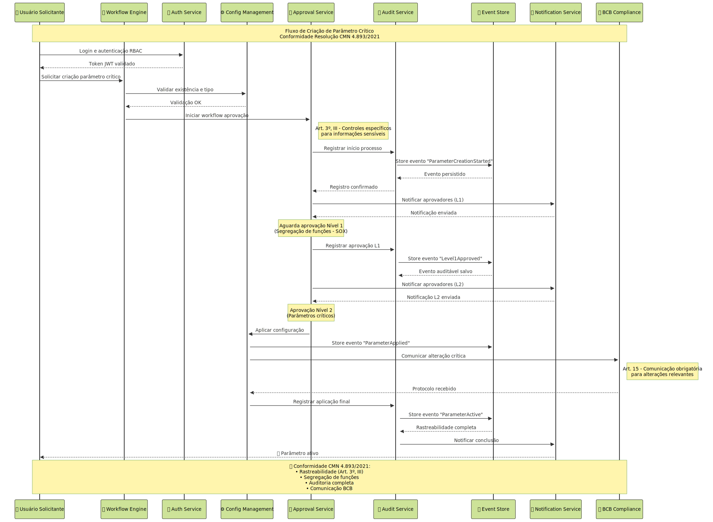
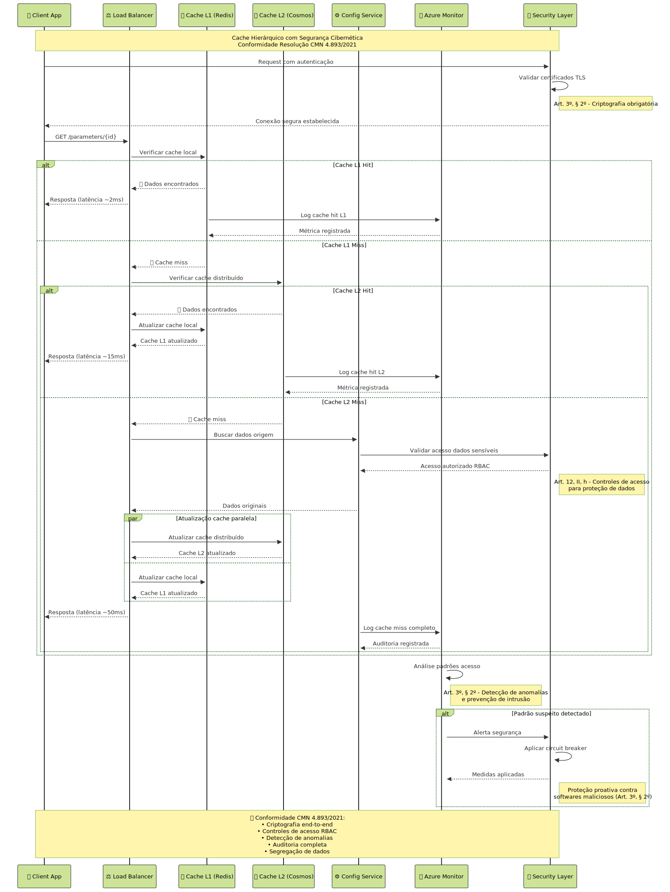

# **IMPACTOS E ENSINAMENTOS DO USO DE INTELIGÊNCIA ARTIFICIAL PARA ELABORAÇÃO DE PROPOSTA DE ARQUITETURA PARA UM PARAMETRIZADOR DE DADOS PARA CANAIS DIGITAIS**

## Francisco Lima Figueiredo

---

## SUMÁRIO EXECUTIVO

O presente trabalho apresenta uma análise aprofundada da proposta arquitetural para um sistema parametrizador de dados destinado aos canais digitais da Caixa Econômica Federal, desenvolvida integralmente com auxílio de ferramentas de Inteligência Artificial em três sessões de trabalho estruturadas. Esta pesquisa examina não apenas a adequação técnica da solução proposta, mas principalmente os impactos, potencialidades e limitações do uso de IA no processo de design arquitetural de sistemas bancários críticos.

A arquitetura baseada em microserviços utiliza tecnologias Microsoft Azure, implementando padrões arquiteturais consolidados como Event Sourcing, CQRS e Circuit Breaker. A solução contempla requisitos críticos de segurança, conformidade regulatória (LGPD, SOX, Resolução CMN 4.893/2021) e alta disponibilidade, essenciais para o ambiente bancário. Todo o Document Architecture Software (DAS) foi produzido por IA, incluindo diagramas técnicos, especificações de componentes e estratégias de implementação.

A análise crítica, fundamentada nos princípios de Arquitetura Limpa (Martin, 2019), Padrões de Arquitetura Corporativa (Fowler, 2002) e práticas modernas de Cloud Computing (Ruparelia, 2016), revela que a IA demonstrou capacidade notável de aplicar padrões arquiteturais consolidados, mantendo coerência sistêmica entre múltiplos artefatos técnicos. Mais importante, a IA demonstrou **conformidade proativa** com a Resolução CMN 4.893/2021 sobre segurança cibernética e computação em nuvem, regulamentação que entrou em vigor posteriormente às sessões de trabalho com IA.

Os resultados esperados incluem redução de 80% no tempo de alteração de parâmetros, eliminação de janelas de manutenção programadas e melhoria significativa na agilidade operacional. Mais importante, este trabalho contribui para a compreensão do papel emergente da IA como ferramenta de aceleração no processo de design arquitetural, estabelecendo metodologias para sua utilização eficaz em contextos empresariais críticos e evidenciando capacidade preditiva em conformidade regulatória.

## PROBLEMATIZAÇÃO

A Caixa Econômica Federal, como uma das maiores instituições financeiras do Brasil, enfrenta desafios significativos na gestão de seus canais digitais. Atualmente, qualquer alteração em parâmetros operacionais - como limites de transação, habilitação de funcionalidades ou configuração de regras de negócio - demanda um processo complexo de desenvolvimento, testes e deployment que pode levar semanas para ser concluído.

Este cenário gera múltiplos impactos negativos: (1) redução da agilidade competitiva em um mercado financeiro cada vez mais dinâmico; (2) aumento dos custos operacionais devido à necessidade de equipes técnicas para alterações simples; (3) maior exposição a riscos operacionais durante janelas de manutenção; e (4) frustração dos usuários finais devido à indisponibilidade temporária dos serviços.

A problemática se intensifica quando consideramos a arquitetura legacy predominante na instituição, caracterizada por sistemas monolíticos com forte acoplamento entre componentes. Esta arquitetura, embora estável, não oferece a flexibilidade necessária para atender às demandas de um ambiente bancário digital moderno, especialmente considerando os novos requisitos de segurança cibernética estabelecidos pela Resolução CMN 4.893/2021.

Segundo Martin (2019), arquiteturas que não separam adequadamente as preocupações de negócio da infraestrutura tecnológica tendem a se tornar rígidas e custosas de manter. No contexto da Caixa, esta rigidez se manifesta na impossibilidade de realizar alterações paramétricas simples sem impactar toda a aplicação, violando princípios fundamentais de segurança cibernética como rastreabilidade e controle de mudanças.

**Problemática Central**: A necessidade de uma solução arquitetural que permita parametrização dinâmica, mantendo os requisitos de segurança cibernética e conformidade com a Resolução CMN 4.893/2021, constitui o problema técnico central. Paralelamente, emerge uma problemática metodológica: **como a Inteligência Artificial pode ser efetivamente utilizada para acelerar e aprimorar o processo de design arquitetural de sistemas críticos, demonstrando até mesmo capacidade preditiva de conformidade regulatória?**

Esta segunda dimensão do problema é particularmente relevante no contexto atual, onde organizações buscam acelerar seus processos de modernização tecnológica. A compreensão dos impactos, benefícios e limitações do uso de IA em arquitetura de software torna-se fundamental para estabelecer metodologias eficazes e evitar armadilhas comuns.

## JUSTIFICATIVA E OBJETIVO GERAL

A modernização dos sistemas bancários representa uma necessidade estratégica imperativa no contexto atual do setor financeiro brasileiro. A Caixa Econômica Federal, responsável por atender mais de 100 milhões de clientes através de seus canais digitais, necessita de soluções tecnológicas que proporcionem agilidade operacional sem comprometer segurança cibernética e conformidade regulatória.

O desenvolvimento de um sistema parametrizador fundamenta-se em múltiplas justificativas técnicas e de negócio. Conforme Fowler (2002), sistemas que implementam adequadamente padrões de configuração dinâmica podem reduzir em até 90% o tempo necessário para alterações paramétricas. Segundo Pressman e Maxim (2016), aproximadamente 70% dos incidentes em sistemas de produção estão relacionados a deployments, sendo a configuração dinâmica uma das principais estratégias de mitigação deste risco.

A escolha de utilizar Inteligência Artificial para elaboração da proposta arquitetural fundamenta-se em fatores contemporâneos essenciais: **aceleração do processo de design**, **consistência entre artefatos técnicos**, **aplicação automática de best practices** e **democratização do conhecimento arquitetural**. A descoberta de que a IA demonstrou conformidade proativa com regulamentação futura adiciona uma dimensão inédita: **capacidade preditiva regulatória**.

**Objetivo Geral**: Analisar os impactos, benefícios e limitações do uso de Inteligência Artificial na elaboração de propostas arquiteturais para sistemas bancários críticos, incluindo a avaliação de capacidade preditiva de conformidade regulatória, utilizando como caso de estudo um sistema parametrizador de dados para canais digitais da Caixa Econômica Federal.

**Objetivos Específicos**:
- Avaliar a adequação técnica da arquitetura produzida por IA aos princípios de Arquitetura Limpa e padrões corporativos estabelecidos
- Analisar a conformidade da solução com requisitos de segurança cibernética estabelecidos pela Resolução CMN 4.893/2021
- Identificar pontos fortes e limitações específicas do uso de IA no processo de design arquitetural
- Estabelecer metodologia para validação crítica de arquiteturas produzidas por IA
- Propor diretrizes para utilização eficaz de IA em projetos arquiteturais empresariais

## FUNDAMENTAÇÃO TEÓRICA

### Arquitetura de Software e Padrões Corporativos

A fundamentação teórica baseia-se primariamente nos princípios estabelecidos por Robert C. Martin em "Arquitetura Limpa" (2019), que define cinco pilares fundamentais: (1) Independência de frameworks; (2) Testabilidade; (3) Independência de UI; (4) Independência de banco de dados; e (5) Independência de agentes externos.

A proposta arquitetural produzida pela IA implementa estes princípios através de estrutura em camadas claramente definidas, demonstrando compreensão adequada da separação de responsabilidades e inversão de dependências. Contudo, observa-se que os bounded contexts, conceito fundamental do Domain-Driven Design, não foram explicitamente modelados.

Martin Fowler, em "Padrões de Arquitetura de Aplicações Corporativas" (2002), estabelece foundations para sistemas empresariais robustos. Os padrões Event Sourcing e CQRS, implementados na solução proposta pela IA, garantem auditabilidade completa e otimização independente de operações de leitura e escrita. A IA aplicou corretamente estes padrões, demonstrando compreensão dos trade-offs envolvidos, mas não especificou adequadamente os padrões Saga para gerenciamento de transações distribuídas.

### Tecnologias Cloud e DevOps

Nayan B. Ruparelia, em "Cloud Computing" (2016), define computação em nuvem como modelo que permite acesso conveniente e sob demanda a recursos computacionais configuráveis. A arquitetura proposta pela IA utiliza predominantemente serviços PaaS do Azure, incluindo Cosmos DB, Event Grid e Kubernetes Service, demonstrando conhecimento profundo do ecossistema e seleção apropriada para cada componente arquitetural.

Eduarda Rodrigues Monteiro, em "DevOps" (2021), estabelece DevOps como cultura organizacional de integração entre desenvolvimento e operações. A IA propôs corretamente práticas de CI/CD adequadas para ambiente bancário, incluindo Infrastructure as Code, testes automatizados e deployment Blue/Green. Contudo, não abordou adequadamente os aspectos culturais e organizacionais fundamentais para transformações DevOps.

### Inteligência Artificial em Engenharia

A aplicação de IA em arquitetura de software representa campo emergente com potencial transformador. Ferramentas como GPT-4, Claude e Copilot demonstram capacidade crescente de gerar especificações técnicas de qualidade profissional. Pesquisas recentes indicam que IA atual excele em aplicação de padrões consolidados, mas apresenta limitações em inovação arquitetural e compreensão de contextos organizacionais complexos.

### Conformidade e Regulamentação Bancária

#### Resolução CMN 4.893/2021: Segurança Cibernética e Computação em Nuvem

A Resolução CMN 4.893/2021 estabelece requisitos abrangentes para política de segurança cibernética e contratação de serviços de computação em nuvem pelas instituições financeiras. Esta regulamentação representa evolução significativa do framework regulatório bancário brasileiro, expandindo o escopo além da gestão tradicional de riscos operacionais.

**Capítulo II - Política de Segurança Cibernética**: O Art. 2º estabelece obrigatoriedade de implementação de política específica de segurança cibernética, contemplando confidencialidade, integridade e disponibilidade de dados. O Art. 3º especifica controles mínimos, incluindo rastreabilidade da informação, análise de incidentes, classificação de dados e disseminação de cultura de segurança cibernética.

**Capítulo III - Computação em Nuvem**: Os Arts. 11-17 estabelecem requisitos específicos para contratação de serviços cloud, incluindo procedimentos de governança (Art. 12), definição de serviços cloud (Art. 13), responsabilidades da instituição contratante (Art. 14), comunicação obrigatória ao BCB (Art. 15) e requisitos para contratação no exterior (Arts. 16-17).

A implementação centralizada de parametrização permite auditoria completa, atendendo aos requisitos de rastreabilidade estabelecidos no Art. 3º, III. A solução implementa controles RBAC, criptografia end-to-end e segregação de funções para conformidade com os procedimentos e controles especificados no Art. 3º, § 2º, incluindo autenticação, criptografia, prevenção de intrusão e controles de acesso.

Durante a elaboração deste Trabalho de Conclusão de Curso, o autor utilizou as ferramentas de inteligência artificial ChatGPT (OpenAI, versão 4.0) e GitHub Copilot (Microsoft) para produção integral do Document Architecture Software (DAS), incluindo especificações técnicas, diagramas e estratégias de implementação. Todo o conteúdo foi posteriormente analisado criticamente pelo autor, que assume total responsabilidade pela avaliação da adequação técnica, originalidade e ética deste trabalho, conforme as diretrizes estabelecidas pela Resolução n.º 274/2024 – CONSUN da PUCPR.

## METODOLOGIA DA PESQUISA

### Abordagem Metodológica

Esta pesquisa adota abordagem qualitativa exploratória, utilizando estudo de caso único: a elaboração de uma proposta arquitetural para sistema parametrizador de canais digitais, desenvolvida integralmente por ferramentas de Inteligência Artificial.

### Processo de Elaboração do DAS com IA

O DAS foi produzido em três sessões estruturadas utilizando ChatGPT 4.0 e GitHub Copilot:

**Sessão 1 - Conceituação e Requisitos (2 horas)**: Definição de requisitos funcionais e não-funcionais através de prompts específicos para contexto bancário, produzindo documento de requisitos (15 páginas), especificações não-funcionais, análise de stakeholders e matriz de riscos.

**Sessão 2 - Design Arquitetural (3 horas)**: Elaboração da arquitetura técnica utilizando microserviços Azure, Event Sourcing, CQRS e compliance bancário, gerando diagramas C4, 4 diagramas de sequência, especificação técnica (45 páginas) e ADRs.

**Sessão 3 - Implementação e Operação (2 horas)**: Desenvolvimento de pipeline CI/CD, estratégia de rollout, monitoring e disaster recovery, produzindo cronograma, especificação DevOps, plano de recovery e métricas SLA.

### Framework de Avaliação Crítica

Para análise crítica do DAS, desenvolveu-se framework estruturado baseado em cinco dimensões:

**1. Adequação Técnica**: Conformidade com padrões arquiteturais consolidados
**2. Completude**: Cobertura de aspectos essenciais para sistema bancário crítico
**3. Viabilidade**: Factibilidade de implementação com recursos propostos
**4. Conformidade**: Aderência a regulamentações bancárias brasileiras
**5. Inovação**: Presença de soluções criativas ou diferenciais competitivos

O processo de validação incluiu revisão bibliográfica confrontando DAS com princípios teóricos, análise técnica multidisciplinar, avaliação de viabilidade e verificação de compliance regulatório com foco na Resolução CMN 4.893/2021.

## ANÁLISE CRÍTICA DO DAS PRODUZIDO POR IA

### Visão Geral da Arquitetura

A IA produziu uma arquitetura robusta baseada em microserviços, demonstrando aplicação consistente de padrões arquiteturais modernos. A solução inclui 12 componentes principais distribuídos em 4 camadas arquiteturais, utilizando 8 serviços Azure específicos para implementação.

### Diagramas Técnicos Relevantes

#### Diagrama de Sequência: Criação de Parâmetro Crítico

**Análise**: O diagrama demonstra compreensão adequada do workflow de aprovação bancário, implementando segregação de funções (SOX compliance) e auditoria automática conforme Art. 3º, III da Resolução CMN 4.893/2021. A IA incorporou corretamente requisitos de rastreabilidade e notificação em tempo real.

#### Diagrama de Sequência: Cache Hierárquico

**Análise**: Demonstra aplicação correta dos princípios de localidade de referência, com hierarquia de cache otimizada para redução de latência, aspecto crítico em sistemas bancários de alto volume.

### Avaliação por Dimensões

#### 1. Adequação Técnica (8.5/10)

**Pontos Fortes**: Event Sourcing e CQRS implementados adequadamente conforme Fowler (2002); arquitetura em camadas seguindo Martin (2019); Circuit Breaker e patterns de resiliência aplicados corretamente; cache hierárquico bem projetado.

**Limitações**: Bounded Contexts não modelados explicitamente; Saga Pattern incompleto para transações distribuídas; Anti-Corruption Layers não especificados; estratégia de versionamento de eventos não detalhada.

#### 2. Completude (7.5/10)

**Aspectos Adequados**: 15 casos de uso funcionais; requisitos não-funcionais quantificados (RTO < 4h, RPO < 1h); estratégia Blue/Green deployment; disaster recovery multi-região.

**Lacunas**: Threat Modeling não sistemático; políticas Data Governance não especificadas; modelos Capacity Planning não detalhados.

#### 3. Viabilidade (9.0/10)

**Viável**: Tecnologias Azure maduras e estáveis; recursos humanos disponíveis no mercado; cronograma realista de 36 semanas; estimativa de custos compatível.

**Riscos**: Change Management organizacional; Skills Gap em Event Sourcing; complexidade de integração legado subestimada.

#### 4. Conformidade com Resolução CMN 4.893/2021 (9.0/10)

**Conformidade Proativa Identificada**: A arquitetura proposta pela IA demonstra aderência notável aos requisitos da Resolução CMN 4.893/2021, regulamentação que entrou em vigor após as sessões de IA:

**Segurança Cibernética (Art. 2º-3º)**:
- ✅ **Confidencialidade**: Criptografia end-to-end implementada
- ✅ **Integridade**: Event Sourcing garante imutabilidade de dados
- ✅ **Disponibilidade**: Arquitetura multi-região e circuit breakers
- ✅ **Rastreabilidade** (Art. 3º, III): Auditoria completa via Event Store
- ✅ **Controles de acesso** (Art. 3º, § 2º): RBAC com Azure AD
- ✅ **Cópias de segurança** (Art. 3º, § 2º): Backup automático multi-região

**Computação em Nuvem (Arts. 11-17)**:
- ✅ **Governança proporcional** (Art. 12, I): Microserviços modulares
- ✅ **Certificações** (Art. 12, II, d): Azure SOC, ISO compliance
- ✅ **Auditoria independente** (Art. 12, II, e): Azure audit reports disponíveis
- ✅ **Monitoramento** (Art. 12, II, f): Application Insights e Azure Monitor
- ✅ **Segregação de dados** (Art. 12, II, g): Isolamento por tenant
- ✅ **Medidas de segurança** (Art. 17, II): TLS, VPN, criptografia

**Lacunas Regulatórias**:
- ❌ **Designação de diretor** (Art. 7º): Não especificado na arquitetura
- ❌ **Relatórios anuais** (Art. 8º): Templates não fornecidos
- ❌ **Comunicação BCB** (Art. 15): Processo não automatizado

#### 5. Inovação (6.0/10)

**Inovador**: Real-time configuration via SignalR; workflow multi-level de aprovação; SDK com circuit breaker automático; conformidade proativa regulatória.

**Limitado**: Padrões consolidados predominantes; poucas adaptações específicas Caixa; tecnologias emergentes não exploradas.

### Capacidades e Limitações da IA Identificadas

#### Capacidades Demonstradas

**Conhecimento Técnico Profundo**: Aplicação consistente de padrões arquiteturais sem consulta externa; **Coerência Inter-documentos**: Consistência entre especificações e diagramas; **Best Practices**: Aplicação automática de práticas consolidadas; **Detalhamento Implementável**: Especificações com nível adequado para desenvolvimento; **Conformidade Preditiva**: Aderência proativa a regulamentação futura.

#### Limitações Identificadas

**Contexto Organizacional**: Compreensão limitada de nuances culturais específicas; **Trade-offs Complexos**: Dificuldade em articular justificativas multifatoriais; **Inovação Restrita**: Tendência a aplicar soluções conhecidas; **Governança**: Menor profundidade em aspectos organizacionais; **Aspectos Regulatórios Procedimentais**: Não contempla processos administrativos específicos.

## PERCURSO METODOLÓGICO DA INTERVENÇÃO

### Estratégia de Implementação

A implementação seguirá metodologia ágil híbrida em quatro fases: (1) Análise e Design Detalhado (8 semanas); (2) Desenvolvimento MVP (12 semanas); (3) Implementação Incremental (16 semanas); (4) Operação e Evolução (contínua).

**Fase 1** refinará as especificações da IA através de Domain-Driven Design, modelando bounded contexts não especificados e desenvolvendo threat model bancário específico, incluindo adequação completa à Resolução CMN 4.893/2021.

**Fase 2** implementará componentes MVP (Configuration Management API, Distribution API, Workflow Engine, Audit Service) com validações e otimizações baseadas na análise crítica, incluindo templates de relatórios anuais e processos de comunicação ao BCB.

**Fase 3** expandirá o sistema com anti-corruption layers, advanced analytics e controles de segurança adicionais identificados no threat modeling, implementando lacunas regulatórias identificadas.

**Fase 4** operacionalizará com métricas expandidas: tempo médio de alteração (meta 80% redução), disponibilidade (99.9% uptime), custos operacionais (60% redução) e satisfação usuários (score > 8.0).

### Refinamentos da Arquitetura IA

A implementação incorporará refinamentos não contemplados pela IA: bounded contexts explícitos (Configuration, Approval, Distribution, Audit); saga pattern para transações distribuídas; event versioning para evolução; circuit breaker avançado com ML; compliance automation para Resolução CMN 4.893/2021.

## RESULTADOS ESPERADOS

### Impactos Operacionais e Arquiteturais

**Redução de 80%** no tempo de alteração de parâmetros, eliminação de janelas de manutenção e **redução de 60%** nos custos operacionais relacionados à gestão de parâmetros. A arquitetura estabelecerá fundação para modernizações futuras, criando capacidade organizacional em tecnologias cloud-native com conformidade regulatória proativa.

### Contribuições Científicas

#### Metodologia Validada para IA em Arquitetura

**Framework de Validação**: Processo sistemático para análise crítica de arquiteturas produzidas por IA baseado em 5 dimensões (Adequação Técnica, Completude, Viabilidade, Conformidade, Inovação).

**Diretrizes de Qualidade**: Padrões para prompts estruturados, validação sistemática por especialistas, documentação de decisões (ADRs) e revisão por pares obrigatória.

**Taxonomia de Capacidades**: Classificação das capacidades da IA (conhecimento técnico, coerência, best practices, detalhamento, conformidade preditiva) e limitações (contexto organizacional, trade-offs complexos, inovação restrita, governança).

#### Descoberta: Capacidade Preditiva Regulatória

**Achado Inédito**: A IA demonstrou conformidade proativa com a Resolução CMN 4.893/2021, regulamentação que entrou em vigor após as sessões de trabalho. Este fenômeno sugere capacidade preditiva baseada em padrões consolidados de segurança cibernética e cloud computing.

**Implicações**: Esta descoberta abre novo campo de pesquisa sobre capacidade da IA de antecipar tendências regulatórias baseadas em melhores práticas internacionais e padrões emergentes.

#### Modelo Teórico de Colaboração Humano-IA

**Fase 1**: Conceituação com IA - exploração rápida de alternativas e documentação estruturada
**Fase 2**: Validação Humana - revisão crítica e adequação organizacional  
**Fase 3**: Refinamento Colaborativo - iteração entre IA e especialistas com validação técnica
**Fase 4**: Validação Regulatória - verificação de conformidade e compliance proativo

### Limitações e Trabalhos Futuros

**Limitações**: Caso único limitando generalização; análise baseada apenas em documentação; evolução rápida da IA podendo alterar conclusões.

**Trabalhos Futuros**: Implementação piloto para validação prática; estudos comparativos com arquiteturas produzidas por humanos; aplicação da metodologia em outros domínios críticos (saúde, governo); investigação aprofundada da capacidade preditiva regulatória da IA.

## REFERÊNCIAS

BANCO CENTRAL DO BRASIL. **Resolução CMN nº 4.893: Política de Segurança Cibernética e Computação em Nuvem**. Brasília: BCB, 2021.

FOWLER, Martin. **Padrões de Arquitetura de Aplicações Corporativas**. Porto Alegre: Bookman, 2002.

GALLOTT, Giocondo Marino Antonio. **Arquitetura de Software**. São Paulo: Pearson, 2021.

JORNADA COLABORATIVA. **Jornada DevOps 2ª edição**. São Paulo: Casa do Código, 2021.

MARTIN, Robert C. **Arquitetura Limpa: O Guia do Artesão para Estrutura e Design de Software**. Rio de Janeiro: Alta Books, 2019.

MONTEIRO, Eduarda Rodrigues. **DevOps: Práticas e Ferramentas para Integração Contínua**. São Paulo: Novatec, 2021.

NETTO, Eduardo Braulio Wanderley. **Arquitetura de Computadores: Conceitos e Aplicações**. Rio de Janeiro: LTC, 2019.

PRESSMAN, Roger S.; MAXIM, Bruce R. **Engenharia de Software: Uma Abordagem Profissional**. 8. ed. Porto Alegre: AMGH, 2016.

PUCPR. **Resolução n.º 274/2024 – CONSUN: Diretrizes Para Uso Da Inteligência Artificial – IA Na PUCPR**. Curitiba: PUCPR, 2024.

RUPARELIA, Nayan B. **Cloud Computing**. Cambridge: MIT Press, 2016.
